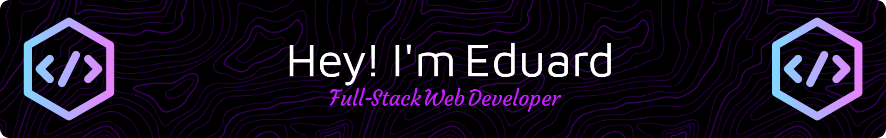

<h3 align="center">Tech Stack:</h3>

  

- 🌱 I’m currently learning **Expo, React-Native, Solito, Next.js etc.**

- 💻 All of my projects are available at [eduardstroescu.com](https://www.eduardstroescu.com)

- 📫 How to reach me: **eduard.stroescu@gmail.com**

<h3 align="center">Connect with me:</h3>

